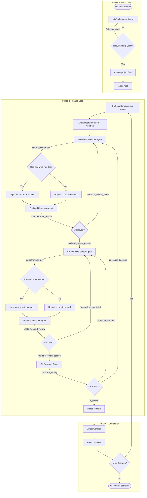

# Extended Ralph Agent Flow with Specialized Agents

---

## Open Questions

### 1. Evolving Requirements Problem

> This design assumes a relatively static set of requirements that get implemented linearly. However, real-world projects rarely work this way:
>
> - Requirements evolve as edge cases are discovered during implementation
> - External factors (dependencies, API changes, user feedback) force pivots
> - The path to the goal changes mid-flight
> - Sometimes the goal itself needs to change or be abandoned
>
> **How do we encode adaptability into this flow?**
>
> Potential approaches to explore:
>
> 1. **Checkpoint reviews**: After each feature, orchestrator reviews if the remaining features still make sense
> 2. **Feedback loops to PRD**: Allow agents to propose PRD amendments when they discover blockers
> 3. **MVP-first with "5 Whys"**: Use rigorous descoping at initialization to reduce the chance of mid-flight pivots
> 4. **Pivot protocol**: Define a formal process for when requirements need to change mid-project
> 5. **Feature dependencies graph**: Track which features depend on others, so pivots can cascade appropriately

### 2. Finding the Best Implementation

> The current design has a single agent implement each part (backend/frontend), and that implementation is what gets used. But how do we know it's the *best* implementation?
>
> **Proposed: Competitive Implementation with Voting**
>
> Instead of a single developer agent, have multiple agents implement the same feature in parallel, then use a panel of reviewers to vote on the best one.
>
> **How it would work:**
>
> ```
> Feature F-001: User Authentication
>
> 1. PARALLEL IMPLEMENTATION PHASE
>    ├── Backend Dev Agent A → Implementation A
>    ├── Backend Dev Agent B → Implementation B
>    └── Backend Dev Agent C → Implementation C (optional)
>
> 2. VOTING PHASE
>    ├── Review Agent 1 → Votes for: B
>    ├── Review Agent 2 → Votes for: A
>    └── Review Agent 3 → Votes for: B
>
>    Winner: Implementation B (2 votes)
>
> 3. NORMAL FLOW CONTINUES
>    └── Implementation B → Review → QA → Fix cycle
> ```
>
> **Voting criteria reviewers would consider:**
>
> - Matches feature expectations/acceptance criteria
> - Code quality and readability
> - Test coverage
> - Performance characteristics
> - Security considerations
> - Simplicity (not over-engineered)
> - **Idiomatic language patterns** - follows best practices for the specific language:
>   - Go: Proper context usage with cancellation, goroutine lifecycle management, error wrapping
>   - TypeScript: Proper async/await patterns, type safety, null handling
>   - Python: Context managers, type hints, pythonic idioms
>   - Rust: Ownership patterns, proper error handling with Result/Option
>   - React: Hooks best practices, proper state management, effect cleanup
>
> **Trade-offs:**
>
>
> | Pros                                                 | Cons                                        |
> | ---------------------------------------------------- | ------------------------------------------- |
> | Higher quality through competition                   | 2-3x more compute/tokens for implementation |
> | Diverse approaches explored                          | More complex orchestration                  |
> | Reduces single-agent bias                            | Need odd number of reviewers to avoid ties  |
> | Learning: losing implementations show what NOT to do | Slower overall throughput                   |
>
>
> **Potential optimizations:**
>
> - Only use competitive mode for complex/critical features
> - Use faster/cheaper models for competing implementations
> - Keep "losing" implementations as reference for future learning
>
> **Open questions within this approach:**
>
> - How many competing implementations? (2 vs 3 vs more)
> - How many reviewers? (3 minimum for tie-breaking)
> - What if all implementations fail to meet criteria?
> - Should reviewers see each other's votes? (probably not, to avoid bias)
> - How to handle the "losing" code? (discard, archive for learning, or merge good parts?)

These remain open design questions for future iteration.

---

## Summary of Changes from Original Ralph


| Aspect             | Original Ralph                      | Extended Flow                                                                      |
| ------------------ | ----------------------------------- | ---------------------------------------------------------------------------------- |
| Agent type         | Single general-purpose coding agent | 5 specialized agents + orchestrator                                                |
| Workflow           | Single agent does all work          | Sequential: Backend Dev -> Backend Review -> Frontend Dev -> Frontend Review -> QA |
| Developer presence | N/A                                 | Both developers always in pipeline (report "no work" if nothing to do)             |
| Review process     | None (just tests)                   | Blocking code review before next stage                                             |
| QA process         | Tests only                          | Dedicated QA agent with targeted feedback loop                                     |
| Work tracking      | prd.json + progress.txt             | feature_list.json + feature_progress.json + tests.json + claude-progress.md        |


---

## Refined Flow (Wording)

### Phase 1: Initialization

1. **Init/Orchestrator Agent** starts and:
  - **Applies "5 Whys" technique** to descope to MVP (see below)
  - Asks clarifying questions about what needs to be implemented
  - Asks about tech stack to configure appropriate skills/MCP servers
  - Validates requirements with the user
  - Creates the project structure:
    - `claude-progress.md` - human-readable progress log
    - `feature_list.json` - features with priority and acceptance criteria
    - `feature_progress.json` - tracks each feature through the pipeline states
    - `tests.json` - maps tests to features
    - `init.sh` or `Makefile` - common workflows (lint, build, test, run)
  - Initializes git repository

#### The "5 Whys" MVP Descoping Process

Before creating the feature list, the orchestrator applies the "5 Whys" technique to ruthlessly descope to a true MVP. This helps mitigate the evolving requirements problem by starting with the smallest viable scope.

**Process:**

1. **Why #1 - Core Problem**: "What is the core problem you're trying to solve?"
  - Strip away all nice-to-haves
  - Identify the single most important outcome
2. **Why #2 - Validation**: "Why is this the right solution to that problem?"
  - Challenge assumptions
  - Ensure we're not building the wrong thing
3. **Why #3 - Scope**: "Why do you need [each proposed feature]?"
  - For each feature, ask if it's essential for the core problem
  - Remove anything that's "nice to have" vs "must have"
4. **Why #4 - Complexity**: "Why does it need to be this complex?"
  - Look for simpler alternatives
  - Can manual processes replace automation initially?
5. **Why #5 - Timeline**: "Why does it need all this now?"
  - What's the smallest thing that provides value?
  - What can be deferred to v2?

**Output:**

After the 5 Whys, the orchestrator produces:

- **MVP Scope**: The absolute minimum set of features
- **Deferred Features**: Features explicitly moved to "later" (not forgotten)
- **Assumptions Log**: Key assumptions that, if wrong, would change the plan

**Example:**

```
User: "I want to build a task management app with priorities, tags, 
       due dates, sharing, notifications, and a calendar view."

5 Whys Output:
- MVP Scope: Create tasks, mark complete, list tasks
- Deferred: priorities (v2), tags (v2), due dates (v2), sharing (v3), 
            notifications (v3), calendar (v3)
- Assumptions: 
  - User needs personal task tracking (not team)
  - Web app is sufficient (no mobile initially)
```

This reduces the chance of mid-project pivots by ensuring we're building the smallest valuable thing first.

### Phase 2: Feature Loop (per feature)

1. **Orchestrator picks next feature** from `feature_list.json`:
  - Highest priority where `status: "pending"`
  - Creates feature branch in a new worktree
  - Updates `feature_progress.json` with state: `"started"`
2. **Backend Development Phase**:
  - **Backend Developer Agent** receives the feature
  - Reads `claude-progress.md`, `feature_progress.json`, and git log to understand context
  - If backend work required:
    - Implements backend code + writes tests
    - Runs linter, tests, and app to verify
    - Commits work when implementation is complete
  - If NO backend work required:
    - Reports "no backend work for this feature"
  - Updates `feature_progress.json` with state and work summary
  - Updates `claude-progress.md` with progress
  - Passes to Backend Reviewer
3. **Backend Review Phase** (blocking):
  - **Backend Reviewer Agent** reviews backend changes
  - If work was done, reviews for:
    - Security, clean code, not over-engineered
    - Tests run and pass
    - Functionally correct per feature spec
  - If issues found: Backend Developer fixes and re-submits
  - If approved (or no work was done): Updates `feature_progress.json` and passes to Frontend Developer
4. **Frontend Development Phase**:
  - **Frontend Developer Agent** receives the feature
  - Reads `claude-progress.md`, `feature_progress.json`, and git log to understand context
  - If frontend work required:
    - Implements frontend code + writes tests
    - Runs linter, tests, and app to verify
    - Commits work when implementation is complete
  - If NO frontend work required:
    - Reports "no frontend work for this feature"
  - Updates `feature_progress.json` with state and work summary
  - Updates `claude-progress.md` with progress
  - Passes to Frontend Reviewer
5. **Frontend Review Phase** (blocking):
  - **Frontend Reviewer Agent** reviews frontend changes
  - If work was done, reviews for:
    - Security, clean code, not over-engineered
    - Tests run and pass
    - Functionally correct per feature spec
  - If issues found: Frontend Developer fixes and re-submits
  - If approved (or no work was done): Updates `feature_progress.json` and passes to QA
6. **QA Phase**:
  - **QA Engineer Agent** tests the complete feature
  - Updates `tests.json` with new/updated tests
  - Updates `feature_progress.json` throughout testing
  - If issues found:
    - Categorizes issue as backend or frontend
    - Updates `feature_progress.json` with issue details
    - Routes back to **specific developer** (targeted feedback)
    - That developer fixes, goes through their review, and returns to QA
    - Cycle repeats until QA passes
  - If all tests pass: Feature approved, updates `feature_progress.json` with state: `"qa_passed"`

### Phase 3: Completion

1. **Merge and Cleanup**:
  - All agents happy (dev, review, QA all pass)
  - Merge feature branch to main
  - Delete worktree
  - QA Agent updates:
    - `feature_list.json` - marks feature as `status: "complete"`
    - `tests.json` - finalizes test mappings
    - `claude-progress.md` - logs completion
    - `feature_progress.json` - marks state: `"complete"`
2. **Repeat** until all features in `feature_list.json` are complete.

---

## Key Files Structure

### feature_list.json

```json
{
  "features": [
    {
      "id": "F-001",
      "title": "User authentication",
      "priority": 1,
      "acceptanceCriteria": [
        "Users can register with email/password",
        "Users can log in and receive JWT token",
        "Login form validates input"
      ],
      "status": "pending"
    }
  ]
}
```

### feature_progress.json

Each agent updates this file as they work on the feature:

```json
{
  "F-001": {
    "state": "frontend_review",
    "history": [
      {
        "state": "backend_dev",
        "agent": "backend-dev",
        "timestamp": "2026-02-02T10:00:00Z",
        "summary": "Implemented auth endpoints and JWT generation",
        "hasWork": true
      },
      {
        "state": "backend_review",
        "agent": "backend-reviewer",
        "timestamp": "2026-02-02T10:30:00Z",
        "approved": true,
        "notes": "Code looks good, tests pass"
      },
      {
        "state": "frontend_dev",
        "agent": "frontend-dev",
        "timestamp": "2026-02-02T11:00:00Z",
        "summary": "Built login form with validation",
        "hasWork": true
      },
      {
        "state": "frontend_review",
        "agent": "frontend-reviewer",
        "timestamp": "2026-02-02T11:30:00Z",
        "approved": false,
        "issues": ["Missing error handling for network failures"]
      }
    ],
    "currentIssues": ["Missing error handling for network failures"]
  }
}
```

### tests.json

```json
{
  "F-001": {
    "backend": ["test_user_registration", "test_jwt_generation"],
    "frontend": ["test_login_form_validation"],
    "e2e": ["test_full_auth_flow"]
  }
}
```

---

## Mermaid Flow Diagram




---

## Agent Responsibilities Summary


| Agent                 | Responsibilities                                              | Updates                                                                  |
| --------------------- | ------------------------------------------------------------- | ------------------------------------------------------------------------ |
| **Orchestrator**      | Coordinates flow, picks features, manages worktrees           | feature_progress.json                                                    |
| **Backend Dev**       | Implements backend code + tests, or reports "no work"         | feature_progress.json, claude-progress.md, commits                       |
| **Frontend Dev**      | Implements frontend code + tests, or reports "no work"        | feature_progress.json, claude-progress.md, commits                       |
| **Backend Reviewer**  | Reviews backend for security, quality, correctness            | feature_progress.json, claude-progress.md                                |
| **Frontend Reviewer** | Reviews frontend for security, quality, correctness           | feature_progress.json, claude-progress.md                                |
| **QA Engineer**       | Tests feature end-to-end, categorizes issues, routes feedback | feature_progress.json, tests.json, feature_list.json, claude-progress.md |


---

## Feature States

The `feature_progress.json` tracks these states:

1. `started` - Orchestrator has picked up the feature
2. `backend_dev` - Backend developer is working
3. `backend_review` - Backend reviewer is reviewing
4. `backend_review_failed` - Backend review found issues, routed back to backend dev
5. `backend_review_passed` - Backend review approved, moving to frontend dev
6. `frontend_dev` - Frontend developer is working
7. `frontend_review` - Frontend reviewer is reviewing
8. `frontend_review_failed` - Frontend review found issues, routed back to frontend dev
9. `frontend_review_passed` - Frontend review approved, moving to QA
10. `qa_testing` - QA engineer is testing
11. `qa_issues_backend` - QA found backend issues, routed back to backend dev
12. `qa_issues_frontend` - QA found frontend issues, routed back to frontend dev
13. `qa_passed` - QA approved the feature
14. `complete` - Feature merged to main

---

## Required Skills, Hooks, and MCP Servers

### 1. Core/Always Required

These are needed for every project regardless of tech stack:


| Component                           | Type  | Source                                                                                   | Purpose                                                   |
| ----------------------------------- | ----- | ---------------------------------------------------------------------------------------- | --------------------------------------------------------- |
| **Destructive Command Guard (dcg)** | Hook  | [GitHub](https://github.com/Dicklesworthstone/destructive_command_guard)                 | Blocks dangerous git/filesystem commands before execution |
| **PRD Generator**                   | Skill | [ralph/skills/prd](https://github.com/snarktank/ralph/blob/main/skills/prd/SKILL.md)     | Generates structured PRDs with clarifying questions       |
| **Ralph PRD Converter**             | Skill | [ralph/skills/ralph](https://github.com/snarktank/ralph/blob/main/skills/ralph/SKILL.md) | Converts PRDs to feature_list.json format                 |
| **Git Worktree**                    | Skill | https://skills.sh/obra/superpowers/using-git-worktrees                                                                                   | Manages worktrees for parallel agent work                 |
| **code-review** | Skill | https://skills.sh/google-gemini/gemini-cli/code-reviewer | Review code |
| **Golang** | Skill | npx skills add https://github.com/jeffallan/claude-skills --skill golang-pro | Programming in Golang |
| **Python** | Skill | npx skills add https://github.com/jeffallan/claude-skills --skill python-pro | Programming in Python |

### 2. Project-Specific (Orchestrator Asks)

The orchestrator should ask about tech stack during initialization and configure these:

#### Backend Technologies


| Stack                  | Skills           | MCP Servers | Linting            | Testing      |
| ---------------------- | ---------------- | ----------- | ------------------ | ------------ |
| **Go**                 | go-skill         | -           | golangci-lint      | go test      |
| **Node.js/TypeScript** | typescript-skill | -           | eslint, prettier   | jest, vitest |
| **Python**             | python-skill     | -           | ruff, black, mypy  | pytest       |
| **Rust**               | rust-skill       | -           | clippy, rustfmt    | cargo test   |
| **Java/Kotlin**        | java-skill       | -           | checkstyle, ktlint | JUnit        |


#### Frontend Technologies


| Stack       | Skills        | MCP Servers | Linting          | Testing                     |
| ----------- | ------------- | ----------- | ---------------- | --------------------------- |
| **React**   | react-skill   | -           | eslint, prettier | jest, react-testing-library |
| **Vue**     | vue-skill     | -           | eslint, prettier | vitest                      |
| **Svelte**  | svelte-skill  | -           | eslint, prettier | vitest                      |
| **Angular** | angular-skill | -           | eslint, prettier | jasmine, karma              |


#### Database Technologies


| Stack          | MCP Servers  | Purpose                            |
| -------------- | ------------ | ---------------------------------- |
| **PostgreSQL** | postgres-mcp | Query execution, schema inspection |
| **MySQL**      | mysql-mcp    | Query execution, schema inspection |
| **MongoDB**    | mongodb-mcp  | Document operations                |
| **Redis**      | redis-mcp    | Cache operations                   |


### 3. Security and Quality Tools

Used by **Backend Reviewer** and **Frontend Reviewer** agents:


| Tool          | Type               | Purpose                                      | Used By          |
| ------------- | ------------------ | -------------------------------------------- | ---------------- |
| **Semgrep**   | Security Scanner   | Static analysis for security vulnerabilities | Both Reviewers   |
| **Snyk**      | Dependency Scanner | Checks for vulnerable dependencies           | Both Reviewers   |
| **SonarQube** | Code Quality       | Code smells, complexity, duplication         | Both Reviewers   |
| **OWASP ZAP** | Security Scanner   | Dynamic security testing                     | QA Engineer      |
| **Trivy**     | Container Scanner  | Container image vulnerabilities              | Backend Reviewer |


### 4. Tooling for init.sh / Makefile

The orchestrator generates build tooling based on stack:


| Stack       | Build Tool                | Commands Generated                                       |
| ----------- | ------------------------- | -------------------------------------------------------- |
| **Node.js** | package.json scripts      | `npm run lint`, `npm test`, `npm run build`, `npm start` |
| **Go**      | Makefile                  | `make lint`, `make test`, `make build`, `make run`       |
| **Python**  | Makefile + pyproject.toml | `make lint`, `make test`, `make run`                     |
| **Rust**    | Cargo.toml                | `cargo clippy`, `cargo test`, `cargo build`, `cargo run` |
| **Docker**  | docker-compose.yml        | `docker-compose up`, `docker-compose test`               |


### 5. QA Engineer Tools

For functional testing, performance testing, and browser automation:

#### Functional Testing


| Tool               | Type               | MCP Server                                  | Purpose                                      |
| ------------------ | ------------------ | ------------------------------------------- | -------------------------------------------- |
| **k6**             | Functional Testing | [k6-mcp](https://github.com/grafana/mcp-k6) | API functional tests with k6 asserts library |
| **Playwright**     | Browser Automation | playwright-mcp                              | E2E testing, UI verification                 |
| **Puppeteer**      | Browser Automation | -                                           | Headless browser testing                     |
| **Cypress**        | E2E Testing        | -                                           | Frontend integration tests                   |
| **Postman/Newman** | API Testing        | -                                           | API contract testing                         |


#### Performance Testing


| Tool           | Type              | MCP Server                                  | Purpose                      |
| -------------- | ----------------- | ------------------------------------------- | ---------------------------- |
| **k6**         | Load Testing      | [k6-mcp](https://github.com/grafana/mcp-k6) | Load and performance testing |
| **Artillery**  | Load Testing      | -                                           | API load testing             |
| **Lighthouse** | Performance Audit | -                                           | Frontend performance metrics |


#### Browser Automation for Visual Verification


| Tool                   | Type               | MCP Server                                  | Purpose                                        |
| ---------------------- | ------------------ | ------------------------------------------- | ---------------------------------------------- |
| **k6 Browser**         | Browser Automation | [k6-mcp](https://github.com/grafana/mcp-k6) | Browser automation with k6 browser module      |
| **dev-browser skill**  | Skill              | -                                           | Visual verification of UI changes (from Ralph) |
| **cursor-ide-browser** | MCP Server         | -                                           | Browser interaction from Cursor                |
| **Playwright MCP**     | MCP Server         | -                                           | Programmatic browser control                   |


### 6. Orchestrator Questions Template

During initialization, the orchestrator should ask:

```
1. What is your backend technology?
   A. Go
   B. Node.js/TypeScript
   C. Python
   D. Rust
   E. Java/Kotlin
   F. Other: [specify]

2. What is your frontend technology?
   A. React
   B. Vue
   C. Svelte
   D. Angular
   E. No frontend (API only)
   F. Other: [specify]

3. What database(s) will you use?
   A. PostgreSQL
   B. MySQL
   C. MongoDB
   D. Redis
   E. SQLite
   F. Multiple: [specify]
   G. None

4. Do you need performance testing?
   A. Yes, with k6
   B. Yes, with Artillery
   C. No performance testing needed

5. What containerization do you use?
   A. Docker
   B. Podman
   C. None
```

Based on answers, the orchestrator:

- Installs/configures required skills
- Sets up MCP servers
- Generates appropriate init.sh/Makefile
- Configures linting and testing commands

### 7. Agent-to-Tool Mapping


| Agent                 | Required Tools                                                |
| --------------------- | ------------------------------------------------------------- |
| **Orchestrator**      | PRD skill, Ralph skill, Git Worktree skill, dcg hook          |
| **Backend Dev**       | Backend language skill, database MCP, linting tools           |
| **Backend Reviewer**  | Security scanners (Semgrep, Snyk), code quality tools         |
| **Frontend Dev**      | Frontend framework skill, linting tools                       |
| **Frontend Reviewer** | Security scanners, accessibility checkers, code quality tools |
| **QA Engineer**       | Playwright/browser MCP, k6 MCP, API testing tools, OWASP ZAP  |


### 8. Installation Commands

Example installation for a Go + React + PostgreSQL stack:

```bash
# Core (always required)
curl -fsSL "https://raw.githubusercontent.com/Dicklesworthstone/destructive_command_guard/master/install.sh" | bash -s -- --easy-mode

# Skills (copy to ~/.claude/skills/ or ~/.config/amp/skills/)
cp -r skills/prd ~/.claude/skills/
cp -r skills/ralph ~/.claude/skills/
cp -r skills/git-worktree ~/.claude/skills/

# MCP Servers (in project .claude/settings.json or global)
# - postgres-mcp for database
# - k6-mcp for performance testing
# - playwright-mcp for browser automation
```

